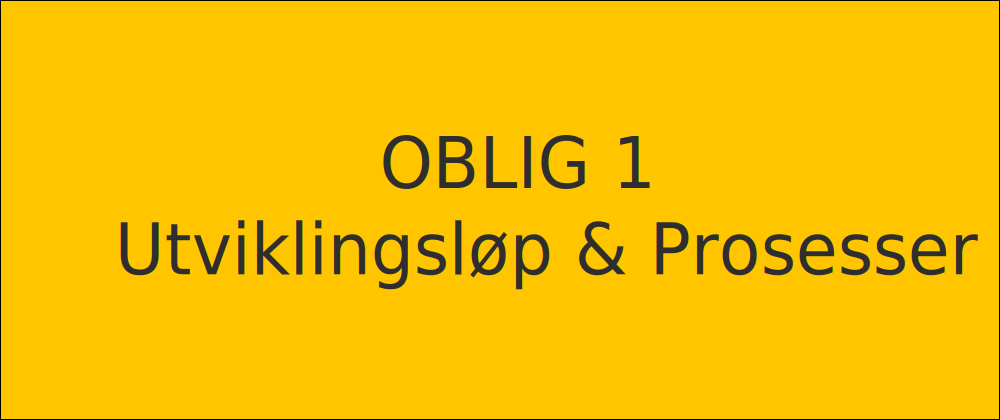

  

Oppgavene har som mål å la deg bli tryggere på det å drive en god utviklingsprosess.  
Alle besvarelsene lastes opp i eget GitHub prosjekt (se oppgave 5).

---
### Oppgave 1
Kunden har en visjon om en løsning hvor en administrator kan lage ulike eksamener. Et scenario kunden ser for seg er at en bedrift kan lage spørsmål til en kursmodul for å avgjøre om en deltaker har bestått eller ikke.
Hver gang man svarer riktig får man poeng. Hvis man svarer feil får man ikke trekk i poengsummen. Hele eksamenen har en makstid satt av administratoren og et minimum antall rette som kreves for å bestå testen.
I første versjon ønsker kunden at det kun er et svar som er riktig og maks 4 svaralternativer.
Deltakerne som gjennomfører testen har hele tiden oversikt over hvor mange spørsmål som har blitt besvart og hvor mange det er igjen.
Avslutningsvis får man en oversikt over resultatene fra eksamen (poengsummen) sin, totalt antall feil, totalt antall riktig og om man klarte testen.
Administratoren skal ha mulighet til å lagre eksamen som en mal for å bruke den en annen gang.
Når eksamen "aktiveres" sender administrator ut en link via e-post til de som har gjennomført et gitt kurs. Deltakeren følger denne linken for å ta eksamen. Hvis deltakeren ikke har konto fra før må den lage seg en konto med eposten de fikk eksamen tilsendt til og et passord.
På en profilside kan deltakeren laste opp et bilde av seg selv, legge til navnet sitt og telefonnummer. Brukernavnet er eposten og kan ikke endres.
Deltakeren kan i ettertid bruke denne kontoen til å gjennomføre andre eksamener. De kan også se hvilke eksamener de har deltatt på og resultatet fra eksamenen. Om de ikke ønsker å ha kontoen lengre kan de velge å slette den.
For alle gjennomførte og godkjente eksamener får deltakeren en eksamen. Hver gang de gjennomfører denne får de en e-post med sertifikatet. Sertifikatet blir også laget på profilen dems.
På profilsiden kan deltakeren laste ned sertifikat i form av PDF om de fikk godkjent eksamen.

- Lage 5 user stories for en applikasjon nevnt ovenfor
- Krav - Er user stories skrevet som As a ..., I want to ..., so that ...
- Krav - Har du tatt hensyn til ulike brukere?

Hjelp: [Hva er markdown?](https://www.shopify.com/partners/blog/86763270-what-is-markdown-syntax)

**Øvningsoppgave:** Lage en markdown fil med user stories som skal lastes opp i oppgave 6
 
---
### Oppgave 2
Kunden av applikasjonen nevnt ovenfor ønsker en å få visualisert hvordan flyten i applikasjonen kan være. Lag en flowchart som viser mulig flyt for "deltakeren" i applikasjonen. Tenk over hvilke handlinger som "kreves" før man kan gå videre i applikasjonen. Mulig verktøy som gjør jobben lettere er [draw.io](https://draw.io), [miro](https://miro.com/app/dashboard/), [adobe xd](https://www.adobe.com/no/products/xd.html), paint, [invision](https://www.invisionapp.com/).
Hjelpeside: [LucidCharts](https://www.lucidchart.com/pages/what-is-a-flowchart-tutorial)

**Øvningsoppgave:** Lag et flytdiagram som kan illustrere prosessen

---
### Oppgave 3
Kunden har en tanke om hvordan løsningen skal se ut og informasjonsarkitekturen. Kunden trenger en landingsside hvor administratoren av eksamen kan lage konto eller logge inn. Kunden trenger deretter en side hvor administratoren kan lage en eksamen og konfigurere den ut fra kravene nevnt tidligere.
Han ønsker også en oversiktsside hvor administratoren kan se alle sine eksamener i et gridformat, med bilde, tittel og kort beskrivelse til hver eksamen og antallet personer som har besvart eksamenen.
Til hver som administratoren har laget ønsker han datatabell med felter for når eksamen ble besvart, hvem som besvarte og om eksamen var godkjent. Han ønsker også å kunne redigere tittel og beskrivelsen til eksamen på denne siden.
Tegne en enkel wireframe for hånd eller i ønsket løsning ([draw.io](https://draw.io), [miro](https://miro.com/app/dashboard/), [adobe xd](https://www.adobe.com/no/products/xd.html), paint, [invision](https://www.invisionapp.com/)).  
Noen eksempler:  
- [Link1](https://draw.io)  
- [Link2](https://www.invisionapp.com/inside-design/wireframe-examples/)

**Øvningsoppgave:** Lag en enkel wireframe for den tenkte nettsiden

---
### Oppgave 4
- Installere VSCode
- Installere Node (node --version i bash / terminal / gitbash / ...)
- Installere Git (git --version i bash / terminal / gitbash / ...)

---
### Oppgave 5
- Sette opp GitHub
- Lage et tomt prosjekt
- Lage en branch kalt *develop*

**Øvningsoppgave:** Commit oppgave 1-3 til develop branch i GitHub 

---
### Oppgave 6 (Frivillig)
- Sette opp Trello
- Lage en tavle med 3 boards for Agil utvikling
- Legg til 3 user stories fra første oppgave
- Hver US skal ha en sjekkliste med 1 punkt
- Knytte disse tre user storiene til en epic
- Sette en dato for en US
---