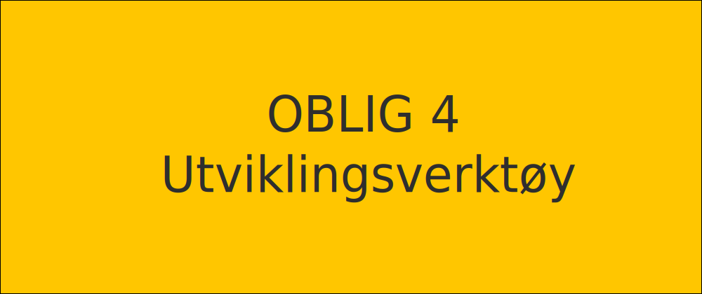

---
Oppgavetekst sist oppdatert 04.02.21

Denne oppgaven handler om å bli kjent med utviklingsverktøyene som skal brukes når det jobbes fremover.

Under ser du hvordan en man som regel går i gang når man skal starte nytt prosjekt fra scratch.

Prosessen:
- Installere Git, Node, NPM
- Lage seg en ny mappe hvor prosjektet skal bo
- git init i denne mappen for å kunne bruke git
- Installere og legge til plugins i VSCode
- npm init -y for initialisere NPM
	- Får da en package.json
- Bruker NPM / Yarn til å installere alt du trenger til eslint, Babel m.m
	- Ex. npm install @babel/core
		- Får en dependency i package.json til @babel/core
		- Får en node_modules mappe
- Konfigurere ex babel, eslint m.fl
- Sette opp "scripts" i package.json: { "start": "a command" }
- Kjører det scriptet med npm run start

---
### Oppgave 1
Lære å bruke Bash
- Lage mappe
- Lage en fil i mappen
- Legge tekst til filen
- Endre innholdet i filen fra kommandolinjen
- Slette filen

**Øvingsoppgave:** Skriv ned kommandoene du bruker i en bash.md fil (eks. ls -la, man rm)

---
### Oppgave 2
- Konfigurere babel
- Konfigurere eslint
- Sette opp parcel eller webpack.
- Ha støtte for scss
- Ha støtte for babel
- Ha støtte for devserve

**Øvingsoppgave:** Sette opp nytt prosjekt med nevnte verktøy, henger sammen med oppgave 3. Lage en index.html, main.js fil med noe "dummykode" og en styles.scss. Dette skal bundles sammen til en bundle.js.

---
### Oppgave 3
- Sette opp git lokalt
- Sette opp nytt repo i Github
- Lage dev branch lokalt
- Lage fil i dev branch lokalt (hiof.js fil med console.log("hiof"))
- Commite disse
- Pushe endringene til repo
- Lage en fil i dev branch remote
- Hente endringene lokalt
- Merge filene fra dev i master
- Samarbeide med en kollega eller en annen konto du har for å få til merge conflict
- Resolve merge conflict
- (frivillig prøve ut stash, pop og cherry-pick)

**Øvingsoppgave:** Lage en git.md fil for kodene du bruker ovenfor (eks. git init, git checkout -b myBranch)

---
### Oppgave 4

Øve på bruk av Chrome Dev tools  
[**HIOF.no** (Lenker til en ekstern side.)](hiof.no)  
- Antall bilder på forsiden
- Lastetid med og uten cache
- Audit
- Antall eksterne requests
- Hva er "Content-Type" i response header på [https://www.hiof.no/tjenester/ (Lenker til en ekstern side.)](https://www.hiof.no/tjenester/)
- Hva er "Cache-Control" i request header på [https://www.hiof.no/tjenester/ (Lenker til en ekstern side.)](https://www.hiof.no/tjenester/)
- Hvilken protokoll bruker den siden?

**Øvingsoppgave:** Lag en chrome.md fil som svarer på spørsmålene ovenfor

---
Commit alt dette til eget github-repo/branch. Del denne linken med studass om du ønsker vurdering.