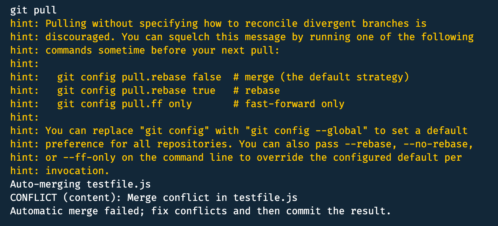

### Oblig 4 - Oppgave 3

---
### Sette opp git lokalt
```
git init
// lager også nytt repo i github som vi skal bruke senere
```
---
### Koble repo
```
git remote add origin https://github.com/tommywm/ITM30617-1_UIN_tommywm
```

---
### Lage dev branch lokalt
```
git checkout -b dev
```

---
### Lage fil i dev branch lokalt (hiof.js fil med console.log("hiof"))
```
touch hiof.js && echo "console.log(\"hiof\");" > hiof.js
```

---
### Commite disse
```
git add hiof.js
git commit -m "🔥  Added hiof.js"
```

---
### Pushe endringene til repo
```
git push -u origin dev
// lager en fil i dev branch remote etter dette
```

---
### Hente endringene lokalt
```
git fetch
git pull
```

---
### Merge filene fra dev i master
```
git checkout main
git merge dev
```

---
### Samarbeide med en kollega eller en annen konto du har for å få til merge conflict
```
// gjør endringer på en fil med en konto direkte i github
// gjør endringer på samme fil og linje med en annen konto lokalt
// forsøker å pushe
// får merge conflict
```


Screenshot av merge conflict

---
### Resolve merge conflict
```
// sender en pull request
// ser over conflict og velger hva som skal beholdes
// klikker på at jeg nå er fornøyd med koden og at nåværende svar skal beholdes (kunne ha valgt å beholde alt)

```


