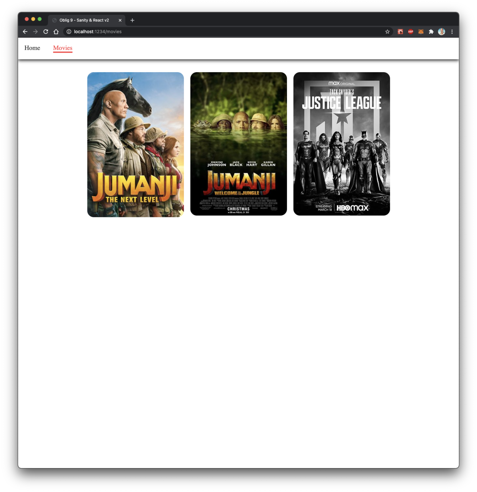
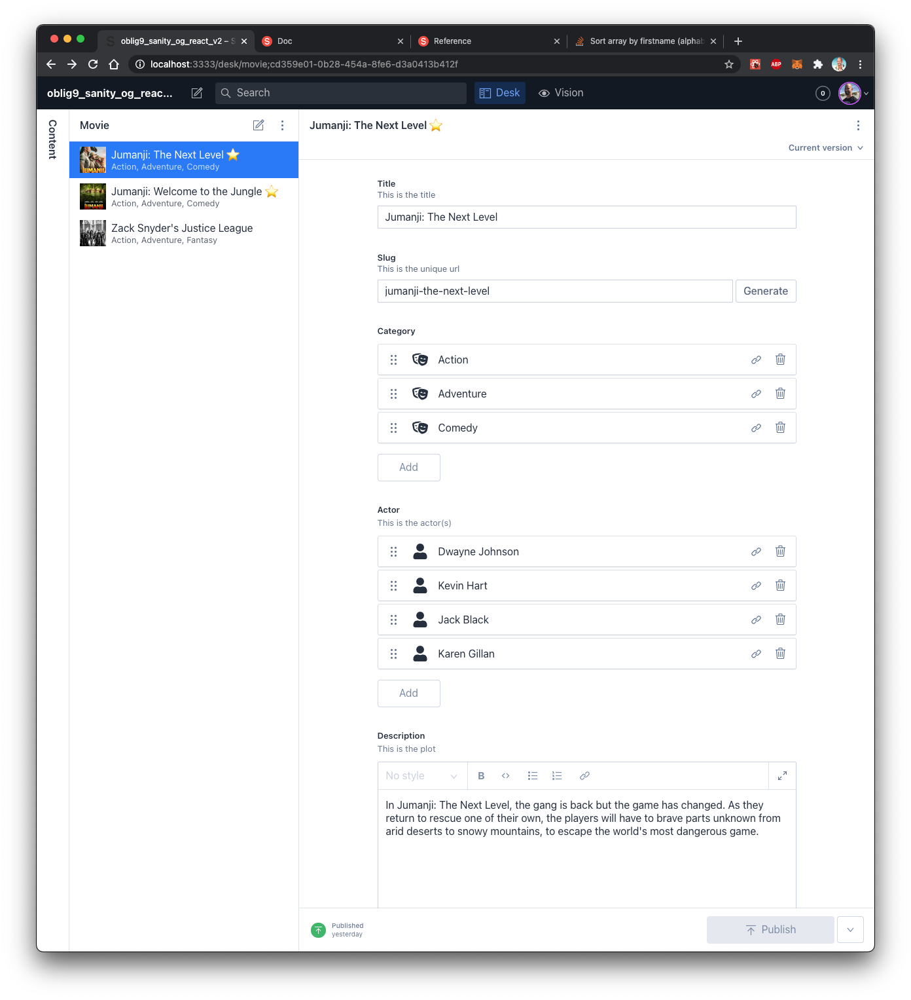

---
### For å kjøre prosjektet er det bare å kjøre følgende kommando:

### React:

```
yarn install
yarn start
```

### Sanity:
```
yarn install
sanity start
```

---
### Oppgavetekst 

Bygger videre på oblig8 - Sanity & React v1.

Leker her med litt portable text, litt mer funksjoner med bilder og generell sanity tweaking. Har laget arrayer til både skuespillere og kategorier. Lagt inn et par booleans også bare for å få lekt med dette.


### Issue:
Opplever en sjelden gang at man ikke får opp noe detaljer på filmen når man går inn på en film. Man får da beskjed om at det ikke finnes en film...  
Om dette skulle skje, gå tilbake til Movies-siden og gå inn på en film igjen. Av og til må man gjøre dette to-tre ganger. Får ikke noen feilmelding, så vanskelig å finne ut hva dette skyldes.

### Movies:
Filmer blir automatisk hentet inn med useEffect();


### Detaljevisning av film:


### Sanity: 
Lekt litt med oppsett og artig visning

